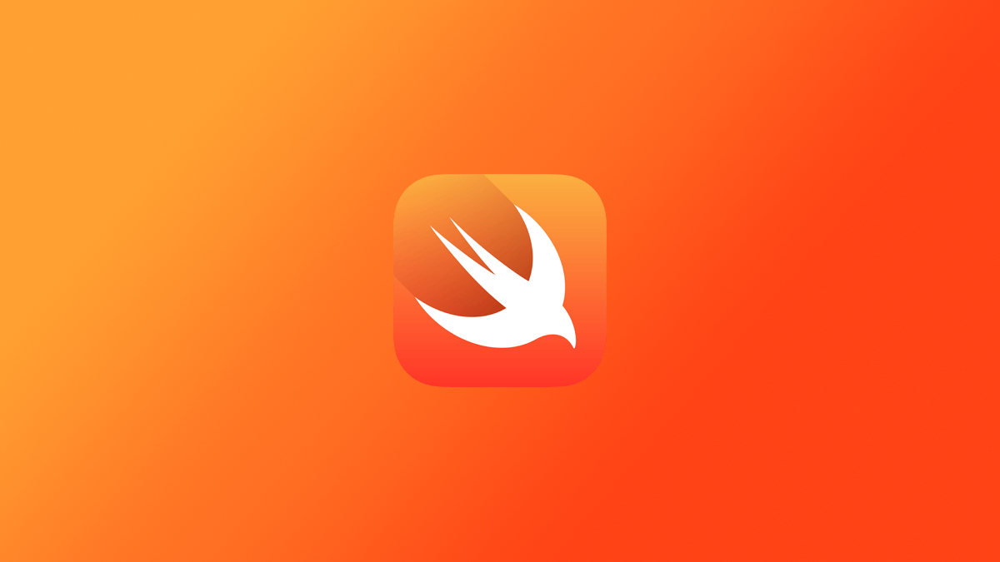
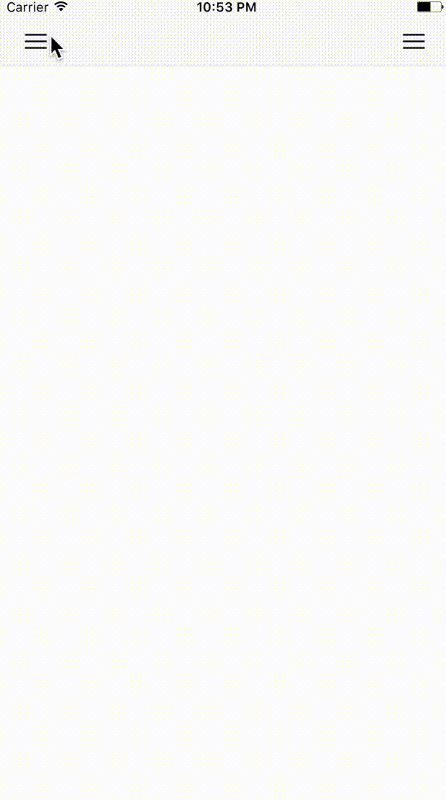
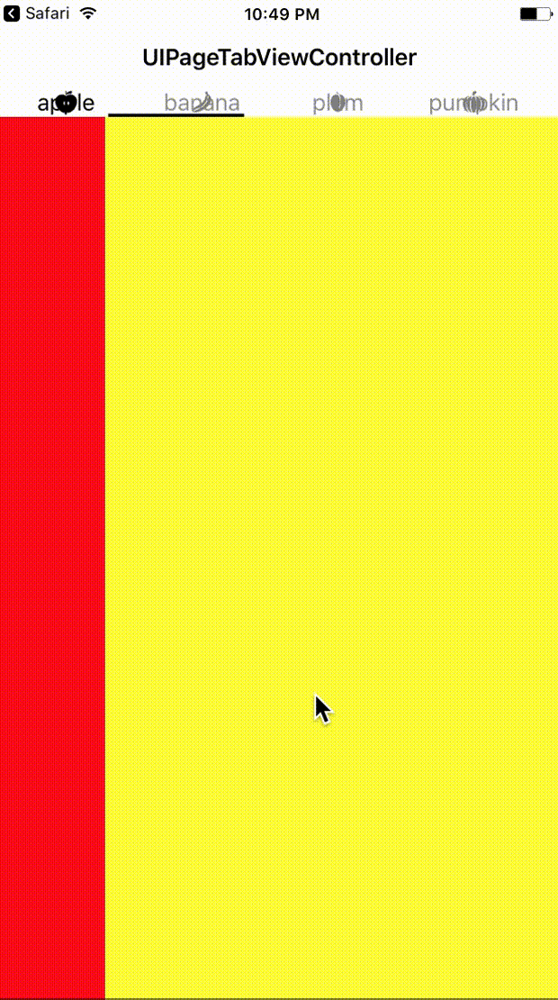
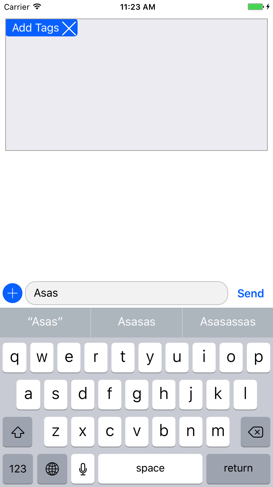

# SwiftMiniProjects


Inspired by the many "30 Swift Projects" I thought it best to break create a single workspace and repo for all mini projects I start. These are not projects focused on building an app but rather classes built to be easily integratable with future apps.

## Contents
- Custom common controllers 


## Details

#### UIDrawerController

```swift
// MARK: - Initialization
public required init(centerViewController: UIViewController, leftViewController: UIViewController?, rightViewController: UIViewController?)
					  
// MARK: - Properties

// When true, menu buttons to open the drawer sides are automatically added and setup
var automaticallyAddMenuButtonItems: Bool

// The darker overlay view that appears in front of the centerViewController when a drawer is open
var overlayView: UIView 

// An accessor to the statusBar to make it easier to toggle its appearance
var statusBar: UIView

// A structure of properties can be created and applied to a drawer side that determine its animation style, frame width and more
public struct UIDrawerSideProperties {
    ...
}
```



### UIPageTabBarController

`UIPageTabBarItems` can have an image and or a title. They are inherited from the standard `UITabBarItem` each `UIViewController` has.

```swift
// MARK: - Initialization
init(viewControllers: [UIViewController])

init()

// MARK - Properties

// An array that holds the controllers. Controllers can be added or deleted. *NOT TESTED
var viewControllers: [UIViewController]

// The position of the tabbar
var tabBarPosition: UIPageTabBarPosition

// If you want to add padding
var tabBarEdgeInsets: UIEdgeInsets

var tabBarHeight: CGFloat

// Set the exact width you want or leave as 0 for auto-width
var tabBarItemWidth: CGFloat 

// THe currentTabLine is the indicator that shows which view controller is active
var currentTabLineHeight: CGFloat
var currentTabLineColor: UIColor

// MARK: - Other
public extension UIViewController {
	// Returns nil if self does not have a UIPageTabBarController as a parent
    var pageTabViewController: UIPageTabBarController? 
}
```



### UIWebViewController

Use the `isUITranslucent` property to easily set all of the UI elements `isTranslucent`. Supports URL parsing to make see if its valid and if not performs a Google search with the input. Similar to how one would use Chrome or Safari.


### UICollectionViewStretchyLayout

Confroms to `UICollectionViewDelegateFlowLayout` for sizing and spacing


### UIMapViewController

A baseline to start integrating a map view into your project. 

### UITagInputView




